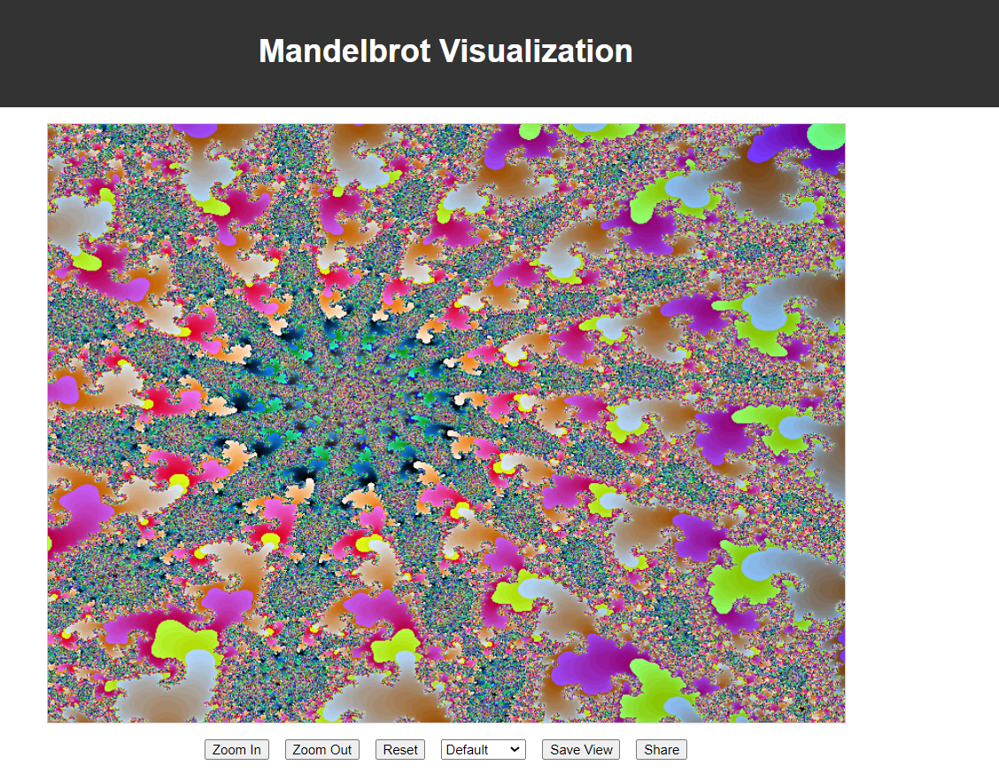

# Mandelbrot Visualization Site (built by [AutoCode](https://autocode.work) in 1 minute)

    

## Overview
This project provides an interactive web-based visualization of the Mandelbrot set, offering users an engaging way to explore this fascinating mathematical concept.

## Features
- Interactive zoom and pan functionality
- Customizable color schemes
- Real-time rendering of the Mandelbrot set
- Ability to save and share specific views

## Planned Improvements
- Implement multi-threading for faster rendering
- Add support for other fractal types (e.g., Julia sets)
- Introduce a mobile-responsive design
- Create a gallery of interesting Mandelbrot regions

## Technical Considerations
- Optimize rendering algorithms for better performance
- Implement WebGL for hardware-accelerated graphics
- Use Web Workers for background calculations
- Implement efficient data structures for storing and manipulating complex numbers

## User Experience Enhancements
- Add an interactive tutorial for new users
- Implement a history feature to track explored areas
- Create a community section for sharing discoveries
- Develop a comparison tool to view different zoom levels side-by-side

## Accessibility
- Ensure keyboard navigation for all features
- Implement high-contrast mode for better visibility
- Add screen reader support for key elements

## Future Directions
- Explore 3D renderings of the Mandelbrot set
- Implement VR support for immersive exploration
- Develop an API for programmatic access to the visualization engine

## Contributing
We welcome contributions! Please see our contributing guidelines for more information on how to get involved.

## License
This project is licensed under the MIT License - see the LICENSE file for details.